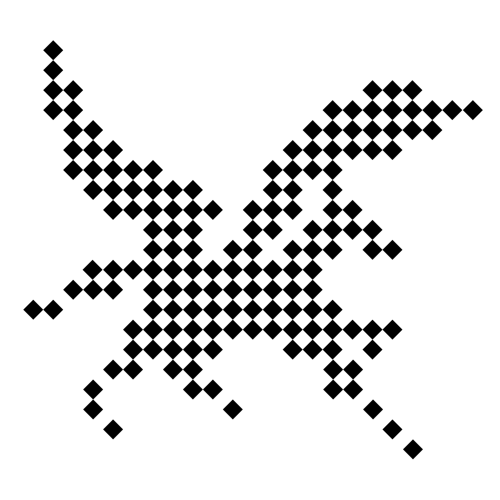
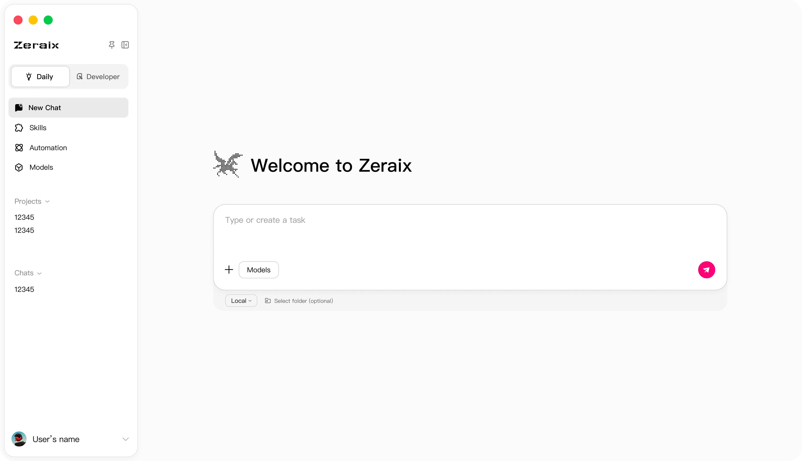

# Zeraix

**Local-first AI assistant + coding agent.**
Download and run on-device models, switch to cloud flagships anytime.

[English](README.md) | [简体中文](README_zh.md)

---

## What is Zeraix?

Zeraix is a desktop AI workspace that puts **local models first**. Run LLMs directly on your own machine for privacy and speed — and seamlessly switch to cloud flagship models when a task needs more horsepower.

- 🔒 **Private by default** — your conversations and files stay on your device
- ⚡ **Fast** — no network round-trip for everyday tasks
- 🔌 **Flexible** — cloud flagships and custom APIs are one click away

## ✨ Features

### 💬 Assistant Mode
Your everyday AI companion — chat, write, summarize, and get things done with built-in tool calling.

### 🛠️ Developer Mode
A coding agent for real work: read and edit files, run commands, and iterate on your codebase.

### 📦 Local Model Management
Download, manage, and run on-device models with a built-in model library. No terminal required — pick a model and go.

### ☁️ Cloud When You Need It
Connect official flagship models (Claude, GPT, Gemini, DeepSeek, Qwen and more) or bring your own API endpoint. Mix local and cloud freely in one workspace.

## 📥 Download

| Platform | Requirements | Download |
|----------|-------------|----------|
| 🍎 macOS | macOS 13+ · Apple Silicon (M1 or later) | [Latest Release](https://github.com/zeraix/Zeraix/releases/latest) |
| 🪟 Windows | Windows 10/11 · x64 | [Latest Release](https://github.com/zeraix/Zeraix/releases/latest) |

> 💡 **Tip:** Local model performance depends on your hardware. 16 GB+ RAM recommended for 7B-class models; more unlocks larger models.

## 🗺️ Roadmap

- [x] Assistant mode with tool calling
- [x] Developer mode (coding agent)
- [x] Local model download & management
- [x] Cloud flagship models & custom API endpoints
- [ ] **Intelligent routing** — automatically pick the best model (local or cloud) for every task based on complexity, cost, and your hardware
- [ ] Multi-model coordination
- [ ] Expanded local model optimizations

> The long-term vision: you shouldn't have to think about *which* model to use. Zeraix will learn to route every task to the right model automatically — that's what we're building toward. Follow the repo to watch it happen. ⭐

## 🌍 Community

- 🐛 [Report a bug](https://github.com/zeraix/Zeraix/issues/new)
- 💡 [Request a feature](https://github.com/zeraix/Zeraix/issues/new)
- 💬 Discussions coming soon

## 📄 License

This project is licensed under the [GNU Affero General Public License v3.0](LICENSE).

For commercial licensing inquiries, please contact us.

---

**If Zeraix is useful to you, consider giving it a ⭐ — it helps a lot!**

